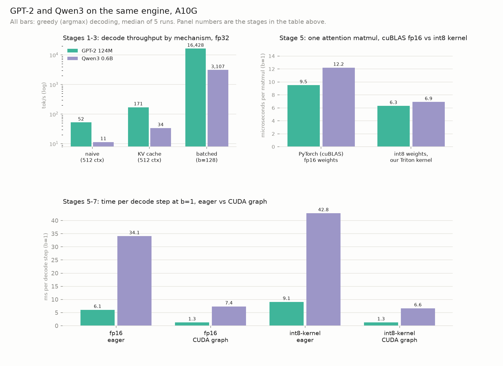
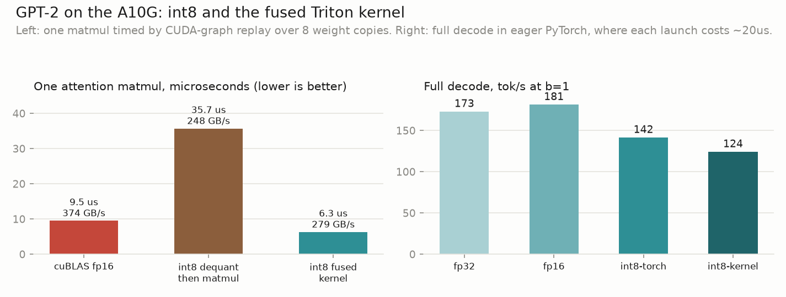
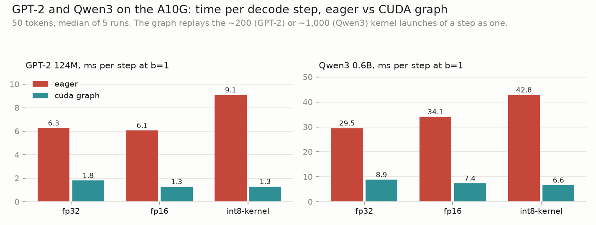

# llm-inference-by-parts

Inference engine built from scratch in PyTorch that serves GPT-2 and Qwen3. The stages of implementation are as follows, with each stage verified against its previous and benchmarked:

| stage | what it does | measured (A10G unless noted) |
|---|---|---|
| 1. forward pass | GPT-2 from scratch; logits match HF to ~1e-4 | — |
| 2. KV cache | preallocated k/v buffers + a counter; decode reads the cache instead of recomputing the context | 3.3x at 512 ctx (60x on M1) |
| 3. batching | left-padded static batches; ORCA-style continuous scheduler: slots, shared frontier, admit/evict per step | ~90x from batching at b=128; continuous 1.5x better mean completion under staggered load |
| 4. serving | FastAPI + SSE, one engine loop per model; dashboard races the mechanisms and draws work per step | ~25% of the 4-slot ceiling delivered (~55% on M1) |
| 5. fp16 / int8 / kernel | fp16 weights; per-channel W8A16 int8 with a slow reference path; fused dequant-matmul Triton kernel; ppl and top-1 gates | kernel 1.5-1.8x faster than cuBLAS fp16 per op at ~50% of bandwidth; +0.03% / +0.75% ppl; end to end launch-bound |
| 6. Qwen3 port | RMSNorm, SwiGLU, RoPE, GQA, QK-Norm on the same skeleton; scheduler, server and quantization unchanged | logits match HF to ~1e-4; same overhead multiple as GPT-2 |
| 7. CUDA-graph decode | decode forward captured once, replayed per step | 3-7x per step; int8-kernel becomes the fastest variant; 3-5x off the bandwidth floor remains |




The engine, measured (`bench/chart_headline.py`):

- The KV cache is worth ~3.3x at 512-token context on the A10G (60x on my
  MacBook Air, where naive full-recompute is pathologically slow under MPS; the
  cache's ultimate purpose is a decode step that doesn't slow down with context,
  see the A10G section).
- Batching adds ~90x of throughput at b=128: since the same weight matrix multiplies
  every row, a decode step reads all the weights once independent of how many
  sequences are in the batch, so 128 sequences take about as long as one.
- Qwen3 (at engine/qwen.py) runs on the same engine as GPT-2 (at engine/model.py), swapping 4
  parts of the model (RMSNorm, SwiGLU, RoPE, GQA) without changes  to the
  cache, scheduler, server, or quantizer. The ratio between the two models is
  the parameter ratio at every stage.
- The int8 path is a hand-written Triton kernel that dequantizes inside the
  matmul: per op it is 1.5-1.8x faster than cuBLAS fp16 at ~50% of A10G
  bandwidth, for +0.03% (GPT-2) / +0.75% (Qwen3) perplexity (`bench/quant.png`).
- In eager mode, fp16 and the int8 kernel don't speed up decode at b=1,
  because the step time is dominated by the cost of launching ~200 kernels
  from Python and not by the bytes read. The int8 kernel is even the slowest
  option, since Triton launches cost more than cuBLAS launches (third panel,
  eager bars). Capturing the decode forward as a CUDA graph removes the launch
  cost. The step is 3-7x faster, and the variants are then ordered by bytes
  read, with int8-kernel the fastest (third panel, CUDA graph bars).
- Continuous batching and the serving layer improve different metrics
  (per-request completion time and delivered throughput) and are measured
  separately below.

## To run

```
pip install -e . && pip install fastapi uvicorn
uvicorn server.app:app --port 8000                # then open http://localhost:8000/
```

The server loads GPT-2 and Qwen3 (one engine loop each; ~1 min on a Mac). The
page races the four mechanisms on the same prompts, one after another so the
timings are fair. Naive, cached and static draw their work per step as it
runs — naive's per-step cost grows with the context, cached stays at one
token, static's rows advance in lockstep — and continuous streams each prompt
live. Greedy by default, so the three blocking outputs are checked against
continuous for identity; a checkbox switches to sampling. Knobs:

```
MODELS=gpt2 uvicorn server.app:app --port 8000    # load only one model
MODEL=qwen  uvicorn server.app:app --port 8000    # both loaded, dropdown defaults to Qwen3
DTYPE=fp16  uvicorn server.app:app --port 8000    # serve in half precision
```

## Architecture

```
 client ──POST /generate──► FastAPI handler ──Request──► inbox (asyncio.Queue)
 client ──POST /generate──► FastAPI handler ──Request──►   │
                                                           ▼
                                              ┌─ engine loop task ──────────────┐
                                              │  drain inbox → engine.submit()  │
                                              │  await to_thread(engine.step()) │◄── GPU thread
                                              │  route events to outboxes       │
                                              └─────────────────────────────────┘
                                                           │ (req_id, token, done)
                              one outbox per request ◄─────┘
 client ◄──SSE token stream── handler awaits its outbox, yields as tokens arrive
```

Inside `engine.step()` — ORCA-style iteration-level scheduling (continuous batching):

```
        ┌──────────────────────── one lap ───────────────────────────┐
        │                                                            │
 waiting│  EVICT      ADMIT            one batched     PICK/HARVEST/ │
 queue ─┼► finished ─► newcomers ────► decode forward ─► DETECT      ├─► next lap
        │  rows free   solo-prefill    (all slots,      per slot     │
        │  their slot  into the slot   one column)                   │
        └────────────────────────────────────────────────────────────┘

 shared KV cache: (n_slots, n_head, max_len, head_size) per layer -- slots are
 recycled; stale k/v from evicted tenants stays in place, masked off forever.
 the attention mask (n_slots, max_len) is the single source of truth for what
 exists; position ids derive from it by cumsum.
```

## Correctness chain

Every layer is tested against the layer below it, anchored to HuggingFace at the bottom:

```
HF fixtures ─► forward pass ─► solo generate ─► static batch ─► EOS ─► engine ─► HTTP server
(test_logits)  (max err ~1e-4)  (test_greedy)   (test_batching)        (test_scheduler)
                                                                       (test_server: 20
                                                                        concurrent, exact)
```

Each sequence in a batch is checked to produce exactly the tokens it produces alone (greedy). This catches any masking, cache-indexing, and position-id bugs.

## Benchmarks (M-series MacBook Air, MPS)

**Decode throughput vs batch size** (`bench/batch.py`, median of 5, per-size
warmup). Extra batch rows are nearly free until compute saturates: decode is
memory-bound, so all rows share one read of the weights.

| b | 1 | 8 | 16 | 32 | 64 | 128 |
|---|---|---|---|---|---|---|
| tok/s | ~40 | ~113 | ~513 | ~908 | ~1460 | ~1998 |

Potential MPS platform quirk (reproducible across reruns): per-row throughput drops from ~40
tok/s at b=1 to ~14 at b=8, then jumps to ~32 at b=16. Likely that MPS uses slow
matmul kernels for mid-size batch shapes and a better path from b=16 up. The
A10G sweep below doesn't have this.

**Continuous vs static batching** (`bench/continuous.py`): staggered workload of 8 requests,
3 slots. Mean completion time is ~1.5x better under continuous scheduling (up to 1.8x across runs). Requests finish at different lengths (2-50 tokens), so under static batching a short request gets stuck waiting for the longest request in its group. Under
continuous batching, a finished request's slot goes to the next request
immediately.


Makespan (time until the last request finishes) is roughly unchanged (6.5s vs 7.4s here — the last 50-token request was admitted later under continuous), since the tokens generated are the same (scheduling only changes who waits). In the chart, the three requests that were stuck behind a 50-token generation decrease from ~6s to ~2.5s.

On the A10G the difference disappears (0.31s vs 0.32s mean); decode steps are
~13x faster, so all 8 requests are done in ~0.5s and there's no meaningful
waiting to redistribute. The benefit of continuous batching is proportional to
how long requests wait, which is a lot in serving in the real world (bigger models, slower
steps, requests arriving all day) and almost nothing in this test.

This closed test doesn't show how with requests arriving over time instead
of all at once, static batching also leaves slots idle while groups form and
drain, where continuous batching keeps every slot busy. Continuous batching introduces a throughput
gain on top of the fairness gain, and it's the main reason production engines
(vLLM, TGI) schedule this way.

**Serving under load** (`bench/load.py`, 4 slots):


Throughput scales until the slots fill (~c=8). Every client added after that just lengthens the queue, which is why the slowest requests (p95 latency) get dramatically worse while throughput actually drops slightly.

At best the server delivers ~48 tok/s, though 4 busy slots can decode ~88
(dashed line, from the batch sweep). 3 reasons:
1. Empty slots: a freed slot can sit idle while the next queued request waits to be admitted (prompt length must be <= the frontier for a batch in progress)
2. Prefill stalls: each admission runs the newcomer's prompt through a solo forward pass, during which no one else decodes
3. Per-token delivery cost: each token crosses the async queue, HTTP, and SSE before reaching a client, stretching every step slightly


## On NVIDIA A10G

Same engine and protocol on an A10G (`bench/modal_bench.py` ->
`modal_results.json`):

| b | 1 | 8 | 16 | 32 | 64 | 128 |
|---|---|---|---|---|---|---|
| total tok/s | 159 | 1,210 | 2,414 | 4,909 | 8,789 | 16,428 |
| per-row tok/s | 159 | 151 | 151 | 153 | 137 | 128 |


Per-row (total / batch size) throughput stays flat and declines gently (each sequence keeps nearly its full speed no matter how many share the batch), which is the expected memory-bound effect, without the cliff seen with MPS.

Naive vs cached at different context lengths: naive is actually faster at a
16-token prompt (196 vs 174 tok/s) because its bigger forward passes spread
per-launch overhead better, but it recomputes the whole context every step, so
it falls to 52 tok/s at 512 context and keeps falling as context grows. KV-cached
does ~174 tok/s at every length, showing decode speed that doesn't depend on context length as expected.

**Serving under load on the A10G** (`bench/modal_load.py`, loopback): delivered
throughput plateaus at ~156 tok/s from c=8 (TTFT 55ms at c=1; p95 2.8s at
c=16). That's ~25% of the 4-slot raw ceiling (~634 tok/s), which is worse than the M1's
~55% — the scheduling overheads (admission waits, prefill stalls, async/HTTP
hops) are fixed costs, so on faster hardware they take a bigger share of each
second.

**Bandwidth check**: each decode step has to read all 124M x 4bytes ~= 0.50 GB of fp32 weights,
and the A10G moves ~600 GB/s, so a step can't take less than 0.5GB / 600GB/s = 0.83 ms. 
Measured:
1000 ms ÷ 173.9 tok/s = 5.75 ms/token
5.75 / 0.83 ~= 6.9
The difference is launch overhead: each layer's forward runs as ~15-20 separate
GPU operations, each individually dispatched from Python — roughly 200 dispatches
per token, and the dispatching costs more time than the math.

(5.75 ms is the single-stream `model.generate` path; the batch table's b=1 of 159 tok/s => 6.3 ms
goes through `generate_batch`, which adds mask/position bookkeeping.)

## vs llama.cpp

Macbook Air with same GPT-2 weights (GGUF from `mradermacher/gpt2-GGUF`), single stream and greedy.

| | this repo (fp32) | llama.cpp f16 | llama.cpp Q8_0 |
|---|---|---|---|
| decode tok/s (b=1) | ~42-55 | 179 | 256 |
| prefill tok/s (512-token prompt) | ~4,000 | 8,825 | 8,162 |

We lose ~3-4x on decode but only ~2x on prefill. 
In ours, Python/dispatch overhead (fixed cost of a forward pass) for prefill is a single forward pass spread over 512 tokens of matmul, whereas decode runs one forward per token.
llama.cpp avoids this overhead with fused C++/Metal kernels (which reduces setup cost / launch overhead). Separately, its Q8_0 quantization format is 1.4x faster than f16 at decode because its weights are half the size. The bottleneck for decode is the memory reads, so fewer bytes per step means more tokens per second. Prefill is still limited by compute.

This comparison is single-stream only. Both engines can batch; we only
benchmarked ours, so the table above measures per-stream speed, not total
throughput.

Reproduce: `brew install llama.cpp`, download the GGUF, then
`llama-bench -m gpt2.f16.gguf -p 512 -n 50 -r 3`.

## fp16

`DTYPE=fp16` loads the weights in half precision. The KV cache buffers follow
automatically (they take their dtype from the weights). Decode is memory-bound,
so half the weight bytes should mean faster decode. fp32's extra precision is
for training; inference only needs the biggest logit to stay biggest.

One code change: the padding mask used `-1e9`, but fp16 caps at ±65,504, so
`-1e9` overflows to `-inf` and all-masked pad rows softmax to NaN. Replaced
with `torch.finfo(dtype).min`.

Accuracy vs the fp32 HF fixtures:

| | fp32 | fp16 |
|---|---|---|
| max logit err (8 fixtures) | ~1e-4 to 3e-4 | 0.14 to 0.44 |
| greedy 50-token match | 8/8 exact | 5/8 exact |

`test_logits` gates at 1e-3 for fp32 and 1.0 for fp16 — each a few times above
the measured correct-code error, and far below the errors real bugs produce
(tens). `test_greedy` requires exact match only at fp32; at fp16 it reports the
match count.

Speed on the A10G (`DTYPE=fp16 modal run bench/modal_bench.py` ->
`modal_results.float16.json`):

| | fp32 | fp16 |
|---|---|---|
| weight bytes per step | 0.50 GB | 0.25 GB |
| bandwidth floor (ms/token) | 0.83 | 0.42 |
| measured (ms/token, b=1) | 5.75 | 5.44 |
| cached decode tok/s (b=1) | ~174 | ~182 |
| batched tok/s (b=128) | 16,428 | 18,324 |
| naive tok/s at 512 context | 52 | 163 |

Halving the weight bytes sped up decode by 6%. It's not 2x because both measurements have
the same ~5 ms of launch overhead plus the bandwidth floor (5.75 = 0.83 + 4.9;
5.44 = 0.42 + 5.0); fp16 only shrinks the floor, so decode is now 13.1x off the
physics instead of 6.9x. The exception is naive at 512 context, 3.1x faster:
recomputing the full context every step is compute-bound matmul work, which
fp16 does accelerate. On the M1 the batch sweep gains 1.4-1.7x from fp16 —
the hardware is slow enough that memory time is a large share of each step,
so halving bytes matters more there.

This is why int8 alone won't help this engine: it moves the floor from 0.42 to
0.21 ms and saves ~0.2 ms of a 5.4 ms step. The quantization work pairs int8
with a fused GPU kernel instead.

GPT-2 logits are around magnitude 100 and fp16 keeps about 3 significant digits, which makes an absolute error of ~0.3 a relative error of ~0.3%. This is the expected precision of fp16. In the 3 generations that diverge, the top two tokens at some step are closer together than the rounding error. Greedy then picks a different token than fp32 and the rest of the generation is different from that point. Exact-match tests can't be used once precision is lossy. The quantization step adds tests that measure quality directly instead (top-1 agreement and perplexity).

## int8

`engine/quant.py` stores each weight matrix as int8 with one fp16 scale per output row (W8A16: int8 weights, fp16 activations). `w ~= q * scale` where `scale = row_max / 127`. The scale is per row because a row with small weights would otherwise be rounded on a grid sized for the largest row. `quantize_model()` swaps every Linear in every block. Embeddings, `lm_head` (weight-tied to the embeddings) and the norms stay fp16.

`QuantLinear.forward` dequantizes the weights back to fp16 and then does a normal matmul. This is deliberately slow. The fp16 copy is written to memory and read back, which is more traffic than fp32. It is the correctness reference for the fused kernel, which does the dequantization in registers instead.

Max logit error vs the fp32 fixtures is 0.65-4.4 (fp16 alone was 0.14-0.44). `tests/test_quant.py` checks 3 things: `|q * scale - w|` stays within half a tick, `QuantLinear` matches the Linear it replaced, and the quantized model stays close to the fixtures.


## Quality gates

`eval/quality.py` runs each precision over a 16k-token slice of WikiText-2. The slice is 32 chunks of 512 tokens with no sliding window, which means the start of each chunk has no context. The perplexity is not comparable to published numbers because of this, but it is valid for comparing the variants against each other.

| | fp32 | fp16 | int8 |
|---|---|---|---|
| perplexity | 37.679 | 37.676 | 37.691 |
| top-1 agreement vs fp32 | — | 98.5% | 97.3% |
| max centered logit diff vs fp32 | — | 2.1 | 10.8 |

int8 costs +0.03% perplexity and picks the same next token as fp32 97.3% of the time. The logit diff is measured after subtracting each position's mean logit. Quantization sometimes shifts a position's whole logit vector by ~200. Softmax only looks at the gaps between logits, which means a uniform shift doesn't change the output and shouldn't count as error. The raw (uncentered) max diff for int8 was 211 and the centered max diff is 10.8.

The same eval on Qwen3-0.6B (`MODEL=qwen modal run eval/modal_quality.py` -> `quality_results.qwen.json`). It runs on the A10G because the 0.6B model runs out of MPS memory at 512-token chunks on the M1.

| | fp32 | fp16 | int8 |
|---|---|---|---|
| perplexity | 15.417 | 15.419 | 15.532 |
| top-1 agreement vs fp32 | — | 99.7% | 97.0% |
| max centered logit diff vs fp32 | — | 0.5 | 18.5 |

int8 costs Qwen3 +0.75% perplexity, 25x more than GPT-2's +0.03%. This is still under the 1% gate, but int8 is not free on this model. It has 196 quantized matmuls per token instead of 48, it has no biases to absorb rounding, and its logits are smaller in magnitude, which makes the same absolute error a bigger relative one.

## GPU kernel

`kernels/dequant_matmul.py` is `QuantLinear.forward` written as one Triton kernel. Each program owns a tile of the output, walks through K in chunks, loads int8 chunks of the weights, and applies the per-row scales after the accumulator loop. The fp16 weights only ever exist in registers, never in memory. This is what the slow path can't do. `tests/test_quant.py` checks the kernel against the slow path on all four layer shapes (max error ~0.03), and on CUDA the whole fixture suite runs through it. The block config (BLOCK_N=32, BLOCK_K=256, 4 warps) was picked by timing a set of configs on the A10G (`kernels/sweep_graph.py`). 2304/32 = 72 programs, one per SM.



Time for one matmul at the decode shape (M=1, c_attn 2304x768), measured by CUDA-graph replay (`bench/modal_quant.py` -> `modal_quant_results.json`):

| | time | bytes read+written | achieved |
|---|---|---|---|
| cuBLAS fp16 | 9.5 us | 3.54 MB | 374 GB/s |
| int8 dequantize-then-matmul | 35.7 us | 8.85 MB | 248 GB/s |
| int8 fused kernel | 6.3 us | 1.77 MB | 279 GB/s (~47% of peak) |

The kernel is 1.5x faster than cuBLAS fp16 at this shape because it reads half the bytes. Two measurement problems came up. A plain Python timing loop gave ~20 us for every config, because it was measuring the ~20 us it takes Python to launch a Triton kernel and not the ~6 us the kernel takes. Replaying one op on one weight tensor served the reads from the 6 MB L2 cache and reported more than 100% of DRAM bandwidth, which is why the bench cycles through 8 copies of the weights.

End to end (b=1 decode):

| | fp32 | fp16 | int8-torch | int8-kernel |
|---|---|---|---|---|
| tok/s | 173 | 181 | 142 | 124 |
| weights read per step | 0.50 GB | 0.25 GB | 0.16 GB | 0.16 GB |

The fastest variant per matmul is the slowest end to end. Every Triton launch costs ~20 us of Python dispatch for ~6 us of GPU work, and there are 48 quantized matmuls per token, which adds ~2.3 ms per token over fp16's cheaper cuBLAS launches. This is the same launch overhead the bandwidth check found. Production engines fix this by capturing the whole decode step in a CUDA graph once and replaying it every token, which is the same mechanism this bench uses for timing. This is implemented in stage 7.

The same bench on Qwen3-0.6B (`MODEL=qwen modal run bench/modal_quant.py` -> `modal_quant_results.qwen.json`). `quantize_model` swaps every `nn.Linear` except the weight-tied `lm_head`, which means it doesn't need layer names. Qwen3 gets 196 QuantLinears vs 48 for GPT-2, and the kernel is unchanged. `tests/test_quant.py` on CUDA checks it against the slow path on all 7 Qwen layer shapes (max error 0.002-0.004).

| | fp32 | fp16 | int8-torch | int8-kernel |
|---|---|---|---|---|
| tok/s (b=1) | 34.5 | 32.5 | 28.1 | 25.5 |
| weights read per step | 2.38 GB | 1.19 GB | 0.75 GB | 0.75 GB |

One `q_proj` matmul (2048x1024, M=1): cuBLAS fp16 12.2 us, fused kernel 6.9 us (304 GB/s, ~51% of peak). This is the same ~1.8x win per matmul as GPT-2, and the same end-to-end loss but bigger. There are 196 launches per token instead of 48, and the ~40 us per launch on the kernel path costs ~8 ms per token against fp16's 31.

## Qwen3 port

`engine/qwen.py` is `model.py` with the 2019 parts swapped for their 2024 versions. The blocks, residuals, KV cache, `generate`, `generate_batch`, the scheduler and the server all carry over unchanged. The target is Qwen3-0.6B-Base: 28 layers, hidden size 1024, 16 q-heads and 8 kv-heads, head_dim 128, vocab 151,936, 32k context.

| GPT-2 | Qwen3 | |
|---|---|---|
| LayerNorm | RMSNorm | no mean subtraction and no bias; only the rescale turned out to matter |
| GELU MLP | SwiGLU | `down(silu(gate(x)) * up(x))`: the nonlinearity is a learned per-channel gate instead of a fixed curve, with three matrices at 3x width instead of two at 4x |
| learned position table `wpe` | RoPE | q and k are rotated by an angle that depends on their position, inside every attention layer, so the q·k score only depends on the distance between the two tokens and there is no table to run off the end of |
| 12 q, 12 k/v heads | GQA: 16 q, 8 k/v | each k/v head serves two q heads, which halves the KV cache |
| — | QK-Norm | RMSNorm on each head's q and k before scoring, which keeps the attention logits bounded (Qwen3 dropped the q/k/v biases for this) |

Tests (`tests/test_qwen.py`, fixtures from `make_fixtures.py Qwen/Qwen3-0.6B-Base`): RoPE's relative-position property, logits vs HF with max error 2e-5 to 1.5e-4 (fp32), greedy 8/8 exact, batched == solo, and the continuous-batching engine == solo for 8 requests on 3 slots. `MODEL=qwen` switches the server and the benches (`engine/load.py`).

A10G (`MODEL=qwen modal run bench/modal_bench.py` -> `modal_results.qwen.json`, `DTYPE=fp16` -> `.qwen.float16.json`):

| | fp32 | fp16 |
|---|---|---|
| cached decode, b=1 (tok/s) | 35.3 | 33.3 |
| ms/token, floor | 28.3, 3.97 | 30.0, 1.99 |
| measured / floor | 7.1x | 15.1x |
| naive at 512 context (tok/s) | 11.4 | 32.9 |
| batched b=128 (tok/s) | 3,107 | 3,617 |
| continuous vs static, mean (8 req, 3 slots) | 1.74 vs 1.78 s | 1.78 vs 1.93 s |

This has the same shape as the GPT-2 data. The overhead multiple is almost the same as GPT-2's (7.1x vs 6.9x). The floor grew 4.8x with the weights, and the launch overhead grew about as much because there are 28 layers instead of 12 and each layer has more launches (three q/k/v projections, two QK-norms, RoPE, the GQA repeat, a third MLP matmul). Overhead scales with the number of launches and not with bytes, which is why fp16 again buys nothing at b=1 and about 3x on the compute-bound naive path.

On the M1 (fp32), cached decode is ~12 tok/s at 16 and 128 context. At 512 context the 2.4 GB model runs out of MPS memory and drops to 0.1-2.5 tok/s. The batch sweep was not run locally.

## CUDA-graph decode

Every decode step runs the same kernels on the same shapes; only the data changes. `Engine.step` now captures the decode forward once (on the first step, after a warmup call) and replays it every step after that. The ~200 (GPT-2) or ~1,000 (Qwen3) Python launches per step become one. Four changes were needed to make the forward capturable: attention runs over the full `max_len` buffer with the mask hiding the unfilled columns instead of slicing per step, the write position is a device tensor (`index_copy_`) instead of a Python int, the cache buffers are zeroed to keep masked columns from producing NaNs, and the harvest/EOS/admit logic stays outside the captured region. Prefill is not captured. This is CUDA only. On MPS the engine runs the same static path eagerly, which is how the correctness tests cover it locally. `modal run kernels/dev.py --name engine_tests` checks the captured path (GPT-2, Qwen3, and the int8 kernel inside the graph) against solo generation.

`modal run bench/modal_graph.py` -> `modal_graph_results.json`, ms per decode step, eager -> graphed:

| | 1 slot | 4 slots |
|---|---|---|
| GPT-2 fp32 | 6.27 -> 1.80 ms (3.5x) | 6.96 -> 2.71 ms (2.6x) |
| GPT-2 fp16 | 6.06 -> 1.29 ms (4.7x) | 7.26 -> 2.08 ms (3.5x) |
| GPT-2 int8-kernel | 9.09 -> 1.30 ms (7.0x) | 10.23 -> 2.16 ms (4.7x) |
| Qwen3 fp32 | 29.50 -> 8.86 ms (3.3x) | 34.23 -> 13.07 ms (2.6x) |
| Qwen3 fp16 | 34.08 -> 7.36 ms (4.6x) | 37.31 -> 10.42 ms (3.6x) |
| Qwen3 int8-kernel | 42.81 -> 6.65 ms (6.4x) | 44.59 -> 10.00 ms (4.5x) |



After CUDA graphing, decode time is ordered by the number of bytes read per step. On Qwen3, int8-kernel takes 6.65 ms, fp16 takes 7.36 ms and fp32 takes 8.86 ms. This is the first configuration where the int8 kernel is the fastest option end to end. Qwen3 fp16 goes from 29 to 136 tok/s at b=1. On GPT-2, int8 and fp16 are equal (1.30 vs 1.29 ms). GPT-2 runs ~200 kernels per step at a few microseconds each, and at that size the step time is dominated by the fixed cost of running each kernel rather than the bytes it reads. Compared to the bandwidth floor, GPT-2 fp16 is 3.1x slower than the minimum (13x before graphing) and Qwen3 int8-kernel is 5.3x slower. The remaining overhead is the per-kernel cost, which can be reduced by fusing kernels into fewer, bigger ones.

## Future Plans

There are a few straightforward methods to improve our engine over 3 aspects: fewer forwards, with speculative decoding; fewer kernels, by fusing norms, RoPE and attention; and better memory using a paged KV cache instead of a reserved max_len per slot. This relates directly to the limitations listed below.


## Limitations
- **No kernel fusion** — attention, norms and RoPE run as separate stock
  kernels (~200 per step for GPT-2, ~1,000 for Qwen3). With launch cost gone,
  their per-kernel execution overhead is what keeps decode 3-5x off the
  bandwidth floor.
- **Pad-and-mask batching, not paged attention** — recycled cache slots waste
  columns on masked-off junk, and the shared frontier burns a column per lap.
- **No chunked prefill** — admitting a long prompt stalls all running streams
  for one forward pass.
- **No per-request cancellation** — a disconnected client's request generates to
  budget anyway.


## Layout

```
engine/model.py        GPT-2 from scratch: forward, KV cache, generate, generate_batch
engine/qwen.py         Qwen3 port: RMSNorm, SwiGLU, RoPE, GQA, QK-Norm on the same skeleton
engine/load.py         MODEL=gpt2|qwen, DTYPE=fp16 knobs -> (model, tokenizer)
engine/quant.py        int8 weights + per-row fp16 scales; QuantLinear (slow reference path)
engine/scheduler.py    Engine: continuous batching (slots, frontier, admit/evict); cuda-graph decode capture
eval/quality.py        quality gates for lossy precision: perplexity, top-1 agreement
kernels/               Triton: fused dequant-matmul + config sweeps (runs on A10G via kernels/dev.py)
server/engine_loop.py  async bridge: inbox -> engine loop task -> per-request outboxes
server/app.py          FastAPI: POST /generate (SSE; model, mode, do_sample/temperature/top_k), browser demo page at /
engine/sampling.py     next-token rule shared by generate_batch and the engine: greedy default, opt-in sampling
tests/                 the correctness chain (pytest tests/); fixtures/<model>/ from make_fixtures.py
bench/                 throughput, latency, and load benchmarks + results
```

## Scripts

```
pytest tests/            # the correctness chain (slow: real model, real server)
python bench/run.py      # naive vs KV cache          -> results.jsonl   (MODEL=qwen -> results.qwen.jsonl, DTYPE=fp16 -> .float16)
python bench/batch.py    # throughput vs batch size   -> batch_results.jsonl
python bench/continuous.py  # continuous vs static    -> continuous_results.jsonl
python bench/load.py     # serving under load         -> load_results.json
python eval/quality.py   # ppl + top-1 per precision  -> eval/quality_results.json
modal run bench/modal_quant.py       # 4-variant decode + per-op kernel bench -> modal_quant_results.json (MODEL=qwen -> .qwen.json)
modal run kernels/dev.py --name tests   # the quant tests on cuda (kernel path live)
modal run kernels/dev.py --name engine_tests   # engine tests on cuda (graph capture live)
modal run bench/modal_graph.py       # eager vs cuda-graph decode, both models -> modal_graph_results.json
python bench/chart_headline.py && python bench/chart_cuda_graph.py && python bench/chart_progression.py && python bench/chart_load.py && python bench/chart_continuous.py && python bench/chart_modal.py
```
