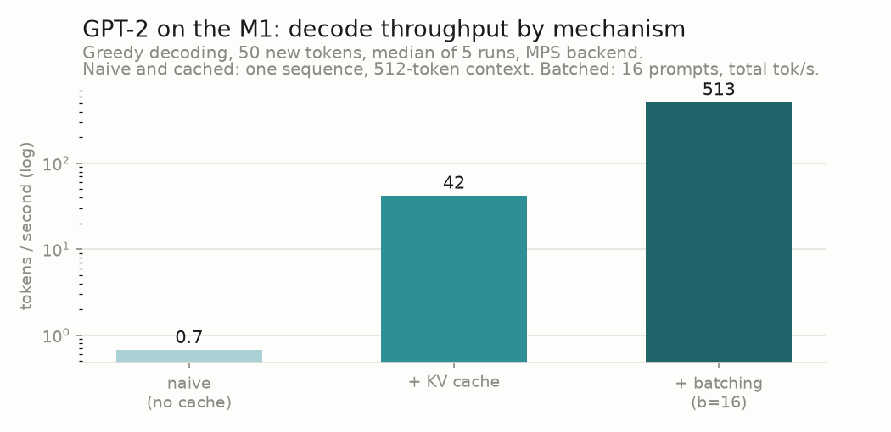
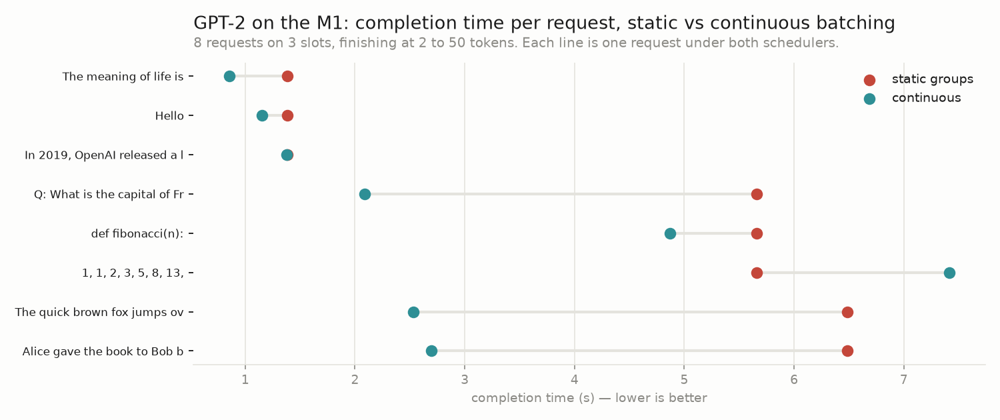
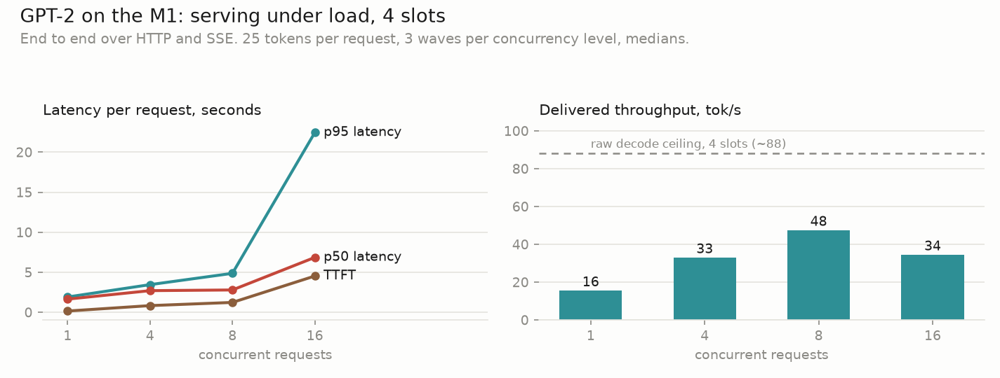
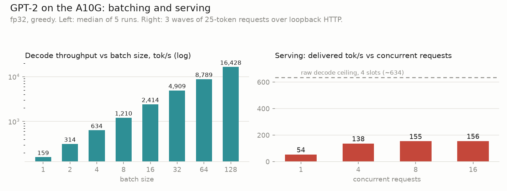

# llm-inference-by-parts

GPT-2 inference engine built from scratch in PyTorch. The stages of implementation are as follows, with each stage verified against its previous and benchmarked:
1) forward pass
2) KV cache
3) static + continuous batching
4) async serving layer (FastAPI)

Future:
5) Quantization + GPU kernel
6) Porting to Qwen (RoPE, GQA, SwiGLU, RMSNorm) 




Each engine optimization, measured (`bench/chart_progression.py`): the KV cache
is worth ~60x at 512-token context on my Macbook Air (naive full-recompute is
pathologically slow under MPS; on an A10G it's 3.3x; the cache's real
purpose is decoding that doesn't slow down with context, see the A10G section);
batching is another ~12x on top (decode is memory-bound, so batch rows ride the same
weight-stream nearly free). Continuous batching and the serving layer improve
different metrics — per-request completion time and delivered throughput, respectively —
and are measured on their own axes in the benchmark sections below.

## To run

```
pip install -e . && pip install fastapi uvicorn
uvicorn server.app:app --port 8000     # then open http://localhost:8000/ in two tabs to generate streams in both over one shared batch
```

## Architecture

```
 client ──POST /generate──► FastAPI handler ──Request──► inbox (asyncio.Queue)
 client ──POST /generate──► FastAPI handler ──Request──►   │
                                                           ▼
                                              ┌─ engine loop task ──────────────┐
                                              │  drain inbox → engine.submit()  │
                                              │  await to_thread(engine.step()) │◄── GPU thread
                                              │  route events to outboxes       │
                                              └─────────────────────────────────┘
                                                           │ (req_id, token, done)
                              one outbox per request ◄─────┘
 client ◄──SSE token stream── handler awaits its outbox, yields as tokens arrive
```

Inside `engine.step()` — ORCA-style iteration-level scheduling (continuous batching):

```
        ┌──────────────────────── one lap ───────────────────────────┐
        │                                                            │
 waiting│  EVICT      ADMIT            one batched     PICK/HARVEST/ │
 queue ─┼► finished ─► newcomers ────► decode forward ─► DETECT      ├─► next lap
        │  rows free   solo-prefill    (all slots,      per slot     │
        │  their slot  into the slot   one column)                   │
        └────────────────────────────────────────────────────────────┘

 shared KV cache: (n_slots, n_head, max_len, head_size) per layer -- slots are
 recycled; stale k/v from evicted tenants stays in place, masked off forever.
 the attention mask (n_slots, max_len) is the single source of truth for what
 exists; position ids derive from it by cumsum.
```

## Correctness chain

Every layer is tested against the layer below it, anchored to HuggingFace at the bottom:

```
HF fixtures ─► forward pass ─► solo generate ─► static batch ─► EOS ─► engine ─► HTTP server
(test_logits)  (max err ~1e-4)  (test_greedy)   (test_batching)        (test_scheduler)
                                                                       (test_server: 20
                                                                        concurrent, exact)
```

Each sequence in a batch is checked to produce exactly the tokens it produces alone (greedy). This catches any masking, cache-indexing, and position-id bugs.

## Benchmarks (M-series MacBook Air, MPS)

**Decode throughput vs batch size** (`bench/batch.py`, median of 5, per-size
warmup). Extra batch rows are nearly free until compute saturates: decode is
memory-bound, so all rows share one read of the weights.

| b | 1 | 8 | 16 | 32 | 64 | 128 |
|---|---|---|---|---|---|---|
| tok/s | ~40 | ~113 | ~513 | ~908 | ~1460 | ~1998 |

Potential MPS platform quirk (reproducible across reruns): per-row throughput drops from ~40
tok/s at b=1 to ~14 at b=8, then jumps to ~32 at b=16. Likely that MPS uses slow
matmul kernels for mid-size batch shapes and a better path from b=16 up. The
A10G sweep below doesn't have this.

**Continuous vs static batching** (`bench/continuous.py`): staggered workload of 8 requests,
3 slots. Mean completion time is ~1.5x better under continuous scheduling (up to 1.8x across runs). Requests finish at different lengths (2-50 tokens), so under static batching a short request gets stuck waiting for the longest request in its group. Under
continuous batching, a finished request's slot goes to the next request
immediately.



Makespan (time until the last request finishes) is roughly unchanged (6.5s vs 7.4s here — the last 50-token request was admitted later under continuous), since the tokens generated are the same (scheduling only changes who waits). In the chart, the three requests that were stuck behind a 50-token generation decrease from ~6s to ~2.5s.

On the A10G the difference disappears (0.31s vs 0.32s mean); decode steps are
~13x faster, so all 8 requests are done in ~0.5s and there's no meaningful
waiting to redistribute. The benefit of continuous batching is proportional to
how long requests wait, which is a lot in serving in the real world (bigger models, slower
steps, requests arriving all day) and almost nothing in this test.

This closed test doesn't show how with requests arriving over time instead
of all at once, static batching also leaves slots idle while groups form and
drain, where continuous batching keeps every slot busy. Continuous batching introduces a throughput
gain on top of the fairness gain, and it's the main reason production engines
(vLLM, TGI) schedule this way.

**Serving under load** (`bench/load.py`, 4 slots):



Throughput scales until the slots fill (~c=8). Every client added after that just lengthens the queue, which is why the slowest requests (p95 latency) get dramatically worse while throughput actually drops slightly.

At best the server delivers ~48 tok/s, though 4 busy slots can decode ~88
(dashed line, from the batch sweep). 3 reasons:
1. Empty slots: a freed slot can sit idle while the next queued request waits to be admitted (prompt length must be <= the frontier for a batch in progress)
2. Prefill stalls: each admission runs the newcomer's prompt through a solo forward pass, during which no one else decodes
3. Per-token delivery cost: each token crosses the async queue, HTTP, and SSE before reaching a client, stretching every step slightly


## On NVIDIA A10G

Same engine and protocol on an A10G (`bench/modal_bench.py` ->
`modal_results.json`):

| b | 1 | 8 | 16 | 32 | 64 | 128 |
|---|---|---|---|---|---|---|
| total tok/s | 159 | 1,210 | 2,414 | 4,909 | 8,789 | 16,428 |
| per-row tok/s | 159 | 151 | 151 | 153 | 137 | 128 |



Per-row (total / batch size) throughput stays flat and declines gently (each sequence keeps nearly its full speed no matter how many share the batch), which is the expected memory-bound effect, without the cliff seen with MPS.

Naive vs cached at different context lengths: naive is actually faster at a
16-token prompt (196 vs 174 tok/s) because its bigger forward passes spread
per-launch overhead better, but it recomputes the whole context every step, so
it falls to 52 tok/s at 512 context and keeps falling as context grows. KV-cached
does ~174 tok/s at every length, showing decode speed that doesn't depend on context length as expected.

**Serving under load on the A10G** (`bench/modal_load.py`, loopback): delivered
throughput plateaus at ~156 tok/s from c=8 (TTFT 55ms at c=1; p95 2.8s at
c=16). That's ~25% of the 4-slot raw ceiling (~634 tok/s), which is worse than the M1's
~55% — the scheduling overheads (admission waits, prefill stalls, async/HTTP
hops) are fixed costs, so on faster hardware they take a bigger share of each
second.

**Bandwidth check**: each decode step has to read all 124M x 4bytes ~= 0.50 GB of fp32 weights,
and the A10G moves ~600 GB/s, so a step can't take less than 0.5GB / 600GB/s = 0.83 ms. 
Measured:
1000 ms ÷ 173.9 tok/s = 5.75 ms/token
5.75 / 0.83 ~= 6.9
The difference is launch overhead: each layer's forward runs as ~15-20 separate
GPU operations, each individually dispatched from Python — roughly 200 dispatches
per token, and the dispatching costs more time than the math.

(5.75 ms is the single-stream `model.generate` path; the batch table's b=1 of 159 tok/s => 6.3 ms
goes through `generate_batch`, which adds mask/position bookkeeping.)

## vs llama.cpp

Macbook Air with same GPT-2 weights (GGUF from `mradermacher/gpt2-GGUF`), single stream and greedy.

| | this repo (fp32) | llama.cpp f16 | llama.cpp Q8_0 |
|---|---|---|---|
| decode tok/s (b=1) | ~42-55 | 179 | 256 |
| prefill tok/s (512-token prompt) | ~4,000 | 8,825 | 8,162 |

We lose ~3-4x on decode but only ~2x on prefill. 
In ours, Python/dispatch overhead (fixed cost of a forward pass) for prefill is a single forward pass spread over 512 tokens of matmul, whereas decode runs one forward per token.
llama.cpp avoids this overhead with fused C++/Metal kernels (which reduces setup cost / launch overhead). Separately, its Q8_0 quantization format is 1.4x faster than f16 at decode because its weights are half the size. The bottleneck for decode is the memory reads, so fewer bytes per step means more tokens per second. Prefill is still limited by compute.

This comparison is single-stream only. Both engines can batch; we only
benchmarked ours, so the table above measures per-stream speed, not total
throughput.

Reproduce: `brew install llama.cpp`, download the GGUF, then
`llama-bench -m gpt2.f16.gguf -p 512 -n 50 -r 3`.

## fp16

`DTYPE=fp16` loads the weights in half precision. The KV cache buffers follow
automatically (they take their dtype from the weights). Decode is memory-bound,
so half the weight bytes should mean faster decode. fp32's extra precision is
for training; inference only needs the biggest logit to stay biggest.

One code change: the padding mask used `-1e9`, but fp16 caps at ±65,504, so
`-1e9` overflows to `-inf` and all-masked pad rows softmax to NaN. Replaced
with `torch.finfo(dtype).min`.

Accuracy vs the fp32 HF fixtures:

| | fp32 | fp16 |
|---|---|---|
| max logit err (8 fixtures) | ~1e-4 to 3e-4 | 0.14 to 0.44 |
| greedy 50-token match | 8/8 exact | 5/8 exact |

`test_logits` gates at 1e-3 for fp32 and 1.0 for fp16 — each a few times above
the measured correct-code error, and far below the errors real bugs produce
(tens). `test_greedy` requires exact match only at fp32; at fp16 it reports the
match count.

Speed on the A10G (`DTYPE=fp16 modal run bench/modal_bench.py` ->
`modal_results.float16.json`):

| | fp32 | fp16 |
|---|---|---|
| weight bytes per step | 0.50 GB | 0.25 GB |
| bandwidth floor (ms/token) | 0.83 | 0.42 |
| measured (ms/token, b=1) | 5.75 | 5.44 |
| cached decode tok/s (b=1) | ~174 | ~182 |
| batched tok/s (b=128) | 16,428 | 18,324 |
| naive tok/s at 512 context | 52 | 163 |

Halving the weight bytes sepd up decode by 6%. It's not 2x because both measurements have
the same ~5 ms of launch overhead plus the bandwidth floor (5.75 = 0.83 + 4.9;
5.44 = 0.42 + 5.0); fp16 only shrinks the floor, so decode is now 13.1x off the
physics instead of 6.9x. The exception is naive at 512 context, 3.1x faster:
recomputing the full context every step is compute-bound matmul work, which
fp16 does accelerate. On the M1 the batch sweep gains 1.4-1.7x from fp16 —
the hardware is slow enough that memory time is a large share of each step,
so halving bytes matters more there.

This is why int8 alone won't help this engine: it moves the floor from 0.42 to
0.21 ms and saves ~0.2 ms of a 5.4 ms step. The quantization work pairs int8
with a fused GPU kernel instead.

GPT-2 logits reach magnitude ~100 and fp16 carries ~3 significant digits, so
~0.3 absolute error is ~0.3% relative, the expected precision of the format.
In the 3 diverging generations, the top two tokens at some step are
scored closer together than the rounding error, so greedy picks a different
token than fp32 would, and generation continues down a different path from
there. Exact-match tests can't gate lossy precision; the
future quantization step would add gates that measure quality directly (top-1 agreement,
perplexity).

## int8

`engine/quant.py` stores each weight matrix as int8 plus one fp16 scale per
output row (`w ~= q * scale`, `scale = row_max / 127`; per-row so a quiet row
isn't rounded on a grid sized for the loudest one). `quantize_model()` swaps
the four Linears in every block. Embeddings, `lm_head` (weight-tied to the
embeddings), and LayerNorms stay fp16.

`QuantLinear.forward` dequantizes to fp16 and then matmuls (deliberately
slow, the fp16 copy round-trips through memory, more traffic than fp32). It's
the correctness reference for the fused kernel, which will dequantizes in
registers instead.

Max logit err vs the fp32 fixtures: 0.65-4.4 (fp16 alone: 0.14-0.44).
`tests/test_quant.py` checks `|q * scale - w|` against the half-tick bound,
QuantLinear against its Linear, and the quantized model against the fixtures.


## Quality gates

`eval/quality.py` runs each precision variant over a 16k-token WikiText-2
slice (32 chunks of 512, no sliding window => blind spot on start of each chunk, so it isn't comparable to
published numbers, but is valid here for the purpose of comparing the variants)

| | fp32 | fp16 | int8 |
|---|---|---|---|
| perplexity | 37.679 | 37.676 | 37.691 |
| top-1 agreement vs fp32 | — | 98.5% | 97.3% |
| max centered logit diff vs fp32 | — | 2.1 | 10.8 |

int8 costs +0.03% perplexity and agrees with fp32 on 97.3% of next-token
picks. The logit diff is measured after subtracting each position's mean
logit: quantization sometimes shifts a position's entire logit vector by ~200,
but softmax only uses the gaps between logits, so a uniform shift can't
affect output and shouldn't count as error. Raw (uncentered) max diff was 211
for int8; centered it's 10.8.

## Limitations
- **Pad-and-mask batching, not paged attention** — recycled cache slots waste
  columns on masked-off junk, and the shared frontier burns a column per lap.
- **No chunked prefill** — admitting a long prompt stalls all running streams
  for one forward pass.
- **No per-request cancellation** — a disconnected client's request generates to
  budget anyway.


## Layout

```
engine/model.py        GPT-2 from scratch: forward, KV cache, generate, generate_batch
engine/quant.py        int8 weights + per-row fp16 scales; QuantLinear (slow reference path)
engine/scheduler.py    Engine: continuous batching (slots, frontier, admit/evict)
eval/quality.py        quality gates for lossy precision: perplexity, top-1 agreement
server/engine_loop.py  async bridge: inbox -> engine loop task -> per-request outboxes
server/app.py          FastAPI: POST /generate (SSE), browser demo page at /
tests/                 the correctness chain (pytest tests/)
bench/                 throughput, latency, and load benchmarks + results
```

## Scripts

```
pytest tests/            # the correctness chain (slow: real model, real server)
python bench/run.py      # naive vs KV cache          -> results.jsonl
python bench/batch.py    # throughput vs batch size   -> batch_results.jsonl
python bench/continuous.py  # continuous vs static    -> continuous_results.jsonl
python bench/load.py     # serving under load         -> load_results.json
python eval/quality.py   # ppl + top-1 per precision  -> eval/quality_results.json
python bench/chart_progression.py && python bench/chart_load.py && python bench/chart_continuous.py && python bench/chart_modal.py
```
